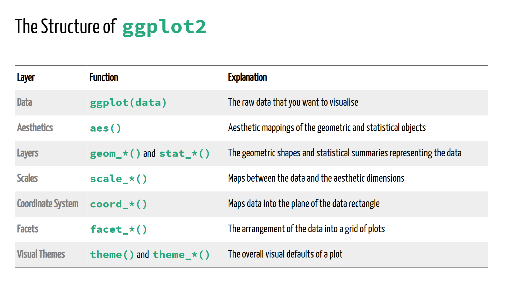

layout: true

<div class="my-footer"><span></span></div> 


```{r setup, include=FALSE}
options(htmltools.dir.version = FALSE)
library(knitr)
knitr::opts_chunk$set(cache = TRUE, 
                      warning = FALSE, 
                      message = FALSE, 
                      dpi = 180,
                      fig.retina = 3,
                      fig.width = 6,
                      fig.asp = 0.618
                      )
#'UNHCR / Americas Bureau /DIMA  <br> <a href="http://github.com/unhcr-americas"><i class="fa fa-github fa-fw"></i>&nbsp; unhcr-americas</a><br> <br><br> See previous Slides available at <https://unhcr-americas.github.io/reproducibility> <br>'

```


---
class: inverse, left, middle

# A Vision for Data Analysis

<span style='font-size:50px; color:grey15;'>"_Multi-functional teams, with strengthened data literacy, regularly conduct meaningful and documented joint data interpretation sessions to define their strategic directions based on statistical evidences_"</span>


???
Slides made with Xaringan - - https://arm.rbind.io/slides/xaringan.html

---

# A Theory of Change for Data analysis

<span style='font-size:30px;'>Proper use of data for advocacy & programmatic decision making </span>

 <span style='font-size:40px;'>&#8618;</span> Corporate __Standards__ exist to define how to encode & process household surveys dataset

 <span style='font-size:40px;'>&#8618;</span> Field data experts are trained based on precise recipes and predefined tools at each step of the __data life cycle__


 <span style='font-size:40px;'>&#8618;</span> Data are presented, discussed and linked to expert knowledge during data __interpretation__ sessions with a multi-functional team


 <span style='font-size:40px;'>&#8618;</span> All potential valid interpretations, including diverging views, are systematically __recorded__

 <span style='font-size:40px;'>&#8618;</span>  __Persuasive__ "Data Stories“ and Policy papers are generated

---

class: left, middle

# Learning objectives

### 1. How to build charts quickly?

### 2. How to calculate impact indicators from survey data? 

### 3. How to answer Key Research Questions? Describe, Explore, Explain...   


???
Depending on the pace of the group, if we do not finish today we will org anise a second session 

---

# Webinar rules

<i class="fa fa-spinner fa-spin fa-fw fa-2x"></i> Leverage this opportunity and make this session __lively__ - there's no stupid questions!

<i class="fa fa-check-square fa-fw fa-2x"></i> Use the __chat__ to send your questions - we are two facilitators and one is focused on replying all questions directly in the chat while the session is on-going

<i class="fa fa-pencil  fa-fw fa-2x"></i> No need to take notes, all the session __content__ will be shared 

<i class="fa fa-cog fa-fw fa-2x"></i> All practical exercises are designed to get you __testing the commands__:

> Login on a dedicated cloud-based version of RStudio with base packages pre-installed for this session @ 
    
> Paste the command from the chat to your online Rstudio session and check what is happening
    
> In case it is not working as expected, share screenshot or error messages from the console in the chat


---

# Click-based Workflow...


.pull-left[

Associate data  with other tables with **ACCESS** 

...then explore through graphs with **EXCEL**  

...then mapping with **ArcGIS** 

]

.pull-right[

..then write up narratives in **WORD**  

... and design a full document with **INDESIGN** 

... or create an infographic with **ILLUSTRATOR** 
]


???
and eventually some VBA macros 

---

## ... coming up with challenges! 

As a coauthor/reader/peer reviewer, one would like to see the whole **research process** (_how we arrived to that conclusion_), rather than cooked manuscript with inserted tables/figures.


.pull-left[

What analysis is **behind the figure**? Did it accounts for [..._new last minute question_...] in the analysis? 
 
What **dataset** (_final vs preliminary version_) was used ? Were **outliers** identified?  

Oops, there is an error in the data. Can we **repeat the analysis**? And update quickly the figures, graphs and tables in the report and the presentation! 
]

.pull-right[
> This consumes time and open space for errors...


]


???

When managing numerous analysis with data that may change and in a collaborative mode, this workflow is **not** the most effective. 

 *  Data are manipulated through "point-and-click" user interfaces that are not __captured__!
 *  Data are moving from a software to another (Excel, GIS, Word...) using different __formats__! 
 *  All results (figures, tables) are **manually** copied/pasted to the final publishing system...
 
---


# Science is '_show me_' - not '_trust me_'!

### Reproducible Research Manisfesto; aka the _"Ten Commandments"_ 

.pull-left[

For every result, **keep track** of how it was produced

**Avoid manual data manipulation** steps

**Archive** the exact versions of all external programs used

**Version control** all custom scripts

**Record all intermediate results**, when possible in standardized formats
]

.pull-right[

For analyses that include randomness, **note underlying random seeds**

Always **store raw data** behind plots

Generate hierarchical analysis output, allowing layers of increasing detail to be inspected

Connect **textual statements** to underlying results

Provide **public access** to scripts, runs, and results
]

---

## Enabling a fully auditable workflow

As soon as all steps (i.e. **DATA + TIDYING + MODELING + VISUALS + NARRATIVE**) are done through **series of written commands recorded in scripts**:

 - when spotting error in the data, or using different dataset, one just need to adjust in the script and report will update automatically;
 
 - Data manipulation becomes be *de facto* fully documented (no more manual changes in Excel);

 - Analysis is self-explanatory and ready for any kind of collaborative review;

 - Customization are facilitated and allow to deliver  final product  with a professional branding and styling.
 
> Analysis becomes streamlined and [reproducible](https://unhcr-americas.github.io/reproducibility)! 

> A "collaboration mode" is enabled from the begining of the process! 


???
 instead of **hundreds of mouse clicks**
See also http://muschellij2.github.io/summerR_2015/modules/module12.html
---

### Key Concept 1: From "click" to "script"

Using the right combination of packages, you can integrate all necessary data analysis steps into **scripts**:

.pull-left[

Data management (import, clean, recode, merge, reshape)

Data analysis (test, regression, multivariate analysis, etc...)
 
Data visualization (plot, map, graph...)

Writing up results (report and presentation generation)

]

.pull-right[


]


 

---


### Key Concept 2: Everything is an object & Anything can be packaged....


.left-column[


]

.right-column[


`Vectors` are a core single data structure, created with `c()`. 

`Data.frame` where each column is a vector, but adjacent vectors can hold different things

`Matrix` just like a data frame except it's all numeric

`List` are made of any dimension, mix and match

`Factors` are a special class that R uses for categorical variables, which also allows for value labeling and ordering.

`Functions` are object designed to transform one object in a new one

`Charts` are objects  designed to generate an image

`Models` are objects recording computation based on specific data 

]


???
Elements in a vector must be of the same type.
Reference link on [Manipulating data](http://www.cookbook-r.com/Manipulating_data/)


---


### Key Concept 3: Search, Test, Try...

.pull-left[


]

.pull-right[

 Training / Certification on R language on [UNHCR Learn & Connect- R training](https://unhcr.csod.com/ui/lms-learner-playlist/PlaylistDetails?playlistId=e90e2279-e3a4-4ef2-8b74-757f91d224b2) 

[`UnhcrDataPackage`]() contains a library of charts

stackoverflow

]


---
class: center, middle, inverse

# Practical Use Case 1 - Charting

### *My boss needs a slide with the main origin of Asylum Seekers and Refugees from Americas in this country... in 5 minutes....* <i class="fa fa-exclamation-circle fa-fw fa-2x"></i> 


---

## How to get to the chart below?

```{r echo=FALSE, out.width = "80%"}
#Prepare data2
library(tidyverse)
thiscountry <- "Panama"

lastyear <- max(unhcrdatapackage::end_year_population_totals_long$Year)
## Loading the stat tables
Origin <- dplyr::left_join( x= unhcrdatapackage::end_year_population_totals_long, 
                                                     y= unhcrdatapackage::reference, 
                                                     by = c("CountryAsylumCode" = "iso_3"))  %>%
  filter(CountryAsylumName  == thiscountry & Year == lastyear &
           Population.type  %in%c("REF", "ASY", "VDA" )) %>%   
  mutate(CountryAsylumName = str_replace(CountryAsylumName, " \\(Bolivarian Republic of\\)", ""),
        CountryAsylumName = str_replace(CountryAsylumName, "Iran \\(Islamic Republic of\\)", "Iran"),
        CountryAsylumName = str_replace(CountryAsylumName, "United Kingdom of Great Britain and Northern Ireland", "UK")) %>% 
  group_by( CountryOriginName) %>%
  summarise(Value2 = sum(Value) )  %>%
  mutate( Value3 =  scales::label_number_si(accuracy = 0.1)(Value2)) %>%
  arrange(desc(Value2)) %>%
  head(10)


if( nrow(Origin) == 0 ){
  cat(paste0("There's no recorded countries of Origin in ",thiscountry )) 
  } else {

#Make plot
ggplot(Origin, aes(x = reorder(CountryOriginName, Value2), ## Reordering country by Value
                           y = Value2)) +
  geom_bar(stat = "identity", 
           position = "identity", 
           fill = "#0072bc") + # here we configure that it will be bar chart+
  geom_label(aes(x = CountryOriginName, y = Value2, 
                #label =  format(round(Value2, -3),  big.mark=",")), 
                label =  Value3), 
             hjust = 1, 
             vjust = 0.5, 
             colour = "white", 
             fill = NA, 
             label.size = NA, 
             family = "Lato", 
             size = 4) + 
  coord_flip() + # Add `coord_flip()` to make your vertical bars horizontal:
  ## and the chart labels
  labs(title = paste0("What are the main Origin of Forced Displacement across Borders?" ),
       subtitle = paste0("Top 10 Originfrom Americas -Data as of ",lastyear, "  in ",thiscountry ), 
       x = " ",
       y = "# of Forcibly displaced people",
       caption = "Data: UNHCR Refugee Population Statistics Database.\n Forced Displacement includes Refugees, Asylym Seekers and Venezuelan Displaced Abroad Population Group.") +
  scale_y_continuous( label = scales::label_number_si()) + ## Format axis number
  geom_hline(yintercept = 0, size = 1.1, colour = "#333333") +
  unhcRstyle::unhcr_theme(base_size = 8)  + ## Insert UNHCR Style
  theme(panel.grid.major.x = element_line(color = "#cbcbcb"), 
        panel.grid.major.y = element_blank()) ### changing grid line that should appear
}
```

???
https://r4ds.had.co.nz/graphics-for-communication.html#figure-sizing 

---

### Create a project and install required packages

.pull-left[
```{r, comment='#'}
library(tidyverse)
library(scales)
library(unhcrdatapackage)
library(unhcRstyle)
library(readxl)

```
]

--

.pull-right[
```{r, echo=FALSE}
 
```
]

---

### Get the data

.pull-left[

To get the data, multiple approach are possible:
 * Got to HDX or Refugee Data Finder to download the data and save them locally within 

```{r, comment='#'}
popdata <- unhcrdatapackage::end_year_population_totals

```
]


--

.pull-right[
```{r, echo=FALSE}
knitr::kable(head(popdata), format = 'html')
```
]

---

### Reshape the data

.pull-left[
```{r, comment='#'}
int_displ <- popdata %>% 
  filter(Year >=2010) %>% 
  group_by(Year) %>% 
  summarise(Refugees = sum(REF, na.rm = TRUE),
            `Asylum-seekers` = sum(ASY, na.rm = TRUE),
            `Venezuelans displaced abroad` = sum(VDA, na.rm = TRUE)) %>% 
  pivot_longer(cols = c("Refugees", "Asylum-seekers", "Venezuelans displaced abroad"),
               values_to = "Number of displaced", names_to = "Population type")

```
]

--

.pull-right[
```{r, echo=FALSE}
knitr::kable(head(int_displ), format = 'html')
```
]

---

### Build the chart

.pull-left[
```{r, eval=FALSE, comment='#'}
# Add data, map to the aesthetic and add a geom #<<
ggplot(data = int_displ) +
  aes(x = Year, y=`Number of displaced`) +
  geom_col()
```
]

--

.pull-right[
```{r , echo=FALSE, dev='ragg_png', dpi=300}
ggplot(data = int_displ) +
  aes(x = Year, y=`Number of displaced`) +
  geom_col()
```

]

---

### Build the chart

.pull-left[
```{r, eval=FALSE, comment='#'}
ggplot(data = int_displ) +
  aes(x = Year, y=`Number of displaced`) +
  geom_col() +
  # Rotate the axis for easier comparison #<<
  coord_flip()  #<<
```
]

--

.pull-right[
```{r , echo=FALSE, dev='ragg_png', dpi=300}
ggplot(data = int_displ) +
  aes(x = Year, y=`Number of displaced`) +
  geom_col() +
  coord_flip()
```
]

---

### Build the chart

.pull-left[
```{r, eval=FALSE, comment='#'}
ggplot(data = int_displ) +
  aes(x = Year, y=`Number of displaced`) +
  geom_col() +
  coord_flip() + 
  
  # Aply unhcr_theme #<<
  unhcr_theme() #<<
```
]

--

.pull-right[
```{r , echo=FALSE, dev='ragg_png', dpi=300}
ggplot(data = int_displ) +
  aes(x = Year, y=`Number of displaced`) +
  geom_col() +
  coord_flip() +
  unhcr_theme()
```
]


---

### Build the chart


.pull-left[

```{r, eval=FALSE, comment='#'}
ggplot(data = int_displ) +
  aes(x = Year, y=`Number of displaced`) +
  geom_col() +
  coord_flip() +
  # Keeps major and minor X gridlines see unhcr_theme doc #<<
  unhcr_theme(grid = "Xx") + 
  # Add information about the graph and define active gridline in unhcr_theme  #<<
  labs(title = "Total number of international displacement", #<<
       subtitle = "Refugees, Asylum-seekers and Venezuelans displaced abroad from 2010 to 2019", #<<
       caption = "Source: UNHCR Data Finder") #<<
```

]

--


.pull-right[

```{r , echo=FALSE, dev='ragg_png', dpi=300}
ggplot(data = int_displ) +
  aes(x = Year, y=`Number of displaced`) +
  geom_col() +
  coord_flip() +
  unhcr_theme(grid = "Xx") +
  labs(title = "Total number of international displacement",
       subtitle = "Refugees, Asylum-seekers and Venezuelans displaced abroad from 2010 to 2019",
       caption = "Source: UNHCR Data Finder")
```

]

---

### Build the chart

.pull-left[

```{r, eval=FALSE, comment='#'}
ggplot(data = int_displ) +
  aes(x = Year, y=`Number of displaced`) +
  # Change color of bars #<<
  geom_col(color = unhcr_blue) + #<<
  coord_flip() +
  unhcr_theme(grid = "Xx") +  
  labs(title = "Total number of international displacement",
       subtitle = "Refugees, Asylum-seekers and Venezuelans displaced abroad from 2010 to 2019", 
       caption = "Source: UNHCR Data Finder") 
```

]

--

.pull-right[

```{r , echo=FALSE, dev='ragg_png', dpi=300}
ggplot(data = int_displ) +
  aes(x = Year, y=`Number of displaced`) +
  geom_col(color = unhcr_blue) +
  coord_flip() +
  unhcr_theme(grid = "Xx") +
  labs(title = "Total number of international displacement",
       subtitle = "Refugees, Asylum-seekers and Venezuelans displaced abroad from 2010 to 2019",
       caption = "Source: UNHCR Data Finder")
```

]

---

### Build the chart

.pull-left[

```{r, eval=FALSE, comment='#'}
ggplot(data = int_displ) +
  aes(x = Year, y=`Number of displaced`) +
  # Change color of bars #<<
  geom_col(fill = unhcr_blue) + #<<
  coord_flip() +
  unhcr_theme(grid = "Xx") +  
  labs(title = "Total number of international displacement",
       subtitle = "Refugees, Asylum-seekers and Venezuelans displaced abroad from 2010 to 2019", 
       caption = "Source: UNHCR Data Finder") 
```

]

--


.pull-right[

```{r , echo=FALSE, dev='ragg_png', dpi=300}
ggplot(data = int_displ) +
  aes(x = Year, y=`Number of displaced`) +
  geom_col(fill = unhcr_blue) +
  coord_flip() +
  unhcr_theme(grid = "Xx") +
  labs(title = "Total number of international displacement",
       subtitle = "Refugees, Asylum-seekers and Venezuelans displaced abroad from 2010 to 2019",
       caption = "Source: UNHCR Data Finder")
```

]

---

### Build the chart

.pull-left[

```{r, eval=FALSE, comment='#'}
ggplot(data = int_displ) +
  aes(x = Year, y=`Number of displaced`) +
  geom_col(fill = unhcr_blue) +
  coord_flip() +
  unhcr_theme(grid = "Xx") +
  labs(title = "Total number of international displacement",
       subtitle = "Refugees, Asylum-seekers and Venezuelans displaced abroad\nfrom 2010 to 2019",
       caption = "Source: UNHCR Data Finder",
       x = "") + #<<
  # Clean subtitle and improve axis labeling and limits #<<
  scale_y_continuous(labels = scales::label_number_si(), #<<
                     limits = c(NA, 30000000)) #<<
```
]

--

.pull-right[

```{r , echo=FALSE, dev='ragg_png', dpi=300}

ggplot(data = int_displ) +
  aes(x = Year, y=`Number of displaced`) +
  geom_col(fill = unhcr_blue) +
  coord_flip() +
  unhcr_theme(grid = "Xx") +
  labs(title = "Total number of international displacement",
       subtitle = "Refugees, Asylum-seekers and Venezuelans displaced abroad\nfrom 2010 to 2019",
       caption = "Source: UNHCR Data Finder",
       x = "") +
  scale_y_continuous(labels = scales::label_number_si(),
                     limits = c(NA, 30000000))
```

]

---

### Build the chart


.pull-left[

```{r, eval=FALSE, comment='#'}
ggplot(data = int_displ) +
  aes(x = Year, y=`Number of displaced`) +
  # What if I want to show the different population type? #<<
  geom_col(aes(fill = `Population type`)) + #<<
  coord_flip() +
  unhcr_theme(grid = "Xx") +
  labs(title = "Total number of international displacement",
       subtitle = "Refugees, Asylum-seekers and Venezuelans displaced abroad\nfrom 2010 to 2019",
       caption = "Source: UNHCR Data Finder",
       x = "") +
  scale_y_continuous(labels = scales::label_number_si(),
                     limits = c(NA, 30000000))
```
]

--

.pull-right[

```{r , echo=FALSE, dev='ragg_png', dpi=300}
ggplot(data = int_displ) +
  aes(x = Year, y=`Number of displaced`) +
  geom_col(aes(fill = `Population type`)) +
  coord_flip() +
  unhcr_theme(grid = "Xx") +
  labs(title = "Total number of international displacement",
       subtitle = "Refugees, Asylum-seekers and Venezuelans displaced abroad\nfrom 2010 to 2019",
       caption = "Source: UNHCR Data Finder",
       x = "") +
  scale_y_continuous(labels = scales::label_number_si(),
                     limits = c(NA, 30000000))
```

]

---

### Build the chart

.pull-left[

```{r, eval=FALSE, comment='#'}
ggplot(data = int_displ) +
  aes(x = Year, y=`Number of displaced`) +
  
  # colors and reorder classes to be more easily comparable #<<
  geom_col(aes(fill = factor(`Population type`, #<<
                             levels = c("Venezuelans displaced abroad", "Asylum-seekers", "Refugees")))) + #<<
  coord_flip() +
  unhcr_theme(grid = "Xx") +
  labs(title = "Total number of international displacement",
       subtitle = "Refugees, Asylum-seekers and Venezuelans displaced abroad\nfrom 2010 to 2019",
       caption = "Source: UNHCR Data Finder",
       x = "") +
  scale_y_continuous(labels = scales::label_number_si(),
                     limits = c(NA, 30000000)) +
  scale_fill_manual(values = usecol(pal = c(unhcr_green, unhcr_darkblue, unhcr_blue))) #<<
```

]

--

.pull-right[

```{r, echo=FALSE, dev='ragg_png', dpi=300}
ggplot(data = int_displ) +
  aes(x = Year, y=`Number of displaced`) +
  geom_col(aes(fill = factor(`Population type`,
                             levels = c("Venezuelans displaced abroad", "Asylum-seekers", "Refugees")))) +
  coord_flip() +
  unhcr_theme(grid = "Xx") +
  labs(title = "Total number of international displacement",
       subtitle = "Refugees, Asylum-seekers and Venezuelans displaced abroad\nfrom 2010 to 2019",
       caption = "Source: UNHCR Data Finder",
       x = "") +
  scale_y_continuous(labels = scales::label_number_si(),
                     limits = c(NA, 30000000)) +
  scale_fill_manual(values = usecol(pal = c(unhcr_green, unhcr_darkblue, unhcr_blue)))
```

]


---

# The Grammar of graphics in 7 key syntax

class: center

.img75[]

[@CedSherer](https://twitter.com/CedScherer/status/1229418108122783744?s=20)

???
**Data**
- Data is not just data
- Representation defines what can be done with it
- Grammar requires a tidy format (though it precedes the notion) 

**Aesthetics**
- Allow generic datasets to be understood by the graphic system.
- Link variables in data to graphical properties in the geometry.

**Layers**
1. Geom
    - How to interpret aesthetics as graphical representations
    - Is a progression of positional aesthetics a number of points, a line, a single polygon, or something else entirely?
2. Stats
    - Transform input variables to displayed values
    - Is implicit in many plot-types but can often be done prior to plotting

**Scales**
- A scale translate back and forth between variable ranges and property ranges
    - Categories > Colour
    - Numbers > Position

**Coordinates**
- Defines the physical mapping of the aesthetics to the paper 

**Facets**
- Define the number of panels with equal logic and split data among them…
- Small multiples 

**Themes**
- Theming spans every part of the graphic that is not linked to data

---


.pull-left[

### Insert this in a slide -  Report template....

All based on Rmarkdown that allow to create multiple outputs from the same content format.

- Powerpoint with UNHCR style

- Word with UNHCR style

- html/bootstrap -scroll-able report

- html/slide - slide-able report (WIP)

- Paginated report built on the top of pagedown.

- Analysis Repository contribution


]

.pull-right[

Access them **"From Template"** panel when creating a new Rmd document


]


---
class: center, middle, inverse


# Practical Use Case 2 - Building impact indicators from Survey Data

### *The National Household Survey is including Forcibly Displaced People and got published yesterday... We need to report our indicators by tomorrow!  * <i class="fa fa-exclamation-triangle fa-fw fa-2x"></i> 


???


We will use the “Encuesta Nacional de Calidad de Vida ECV 2020” published by the National Office of Colombia (http://microdatos.dane.gov.co/index.php/catalog/718/get_microdata) and explore different type of statistical analysis based on an example of three research questions:


---

## Get the data


The dataset,  [Encuesta Nacional de Calidad de Vida ECV 2020, Colombia, DANE](http://microdatos.dane.gov.co/index.php/catalog/718/get_microdata) is available through a micro data library. The particularity of HH survey dataset, when stored in SPSS (`.sav`), SAS (`.sas7bdat`), or Stata (`.dta`) format is that they usually contains both values and __associated labels__ (we call them `labelled data`).

.pull-left[

```{r , eval=FALSE, comment='#'}
# http://microdatos.dane.gov.co/index.php/catalog/718/get_microdata 
## Start with Household composition where disaggregation variables are
data0 <- haven::read_sav(here::here("data-raw", "Características y composición del hogar.sav"))

# Multiple labelled files shall first be merged together.  
data1 <- haven::read_sav(here::here("data-raw", "Condiciones de vida del hogar y tenencia de bienes.sav"))
data <- dplyr::left_join(data0, data1, by = c("DIRECTORIO", "SECUENCIA_ENCUESTA", "SECUENCIA_P",       
                                              "ORDEN", "FEX_C" ) )


# create data dictionary 
dictionary <- labelled::generate_dictionary(data)

## Display frame content
data %>% 
       sjPlot::view_df()
```
]

--

.pull-right[
```{r , echo=FALSE}
# http://microdatos.dane.gov.co/index.php/catalog/718/get_microdata 
## Start with Household composition where disaggregation variables are
data0 <- haven::read_sav(here::here("data-raw", "Características y composición del hogar.sav"))

# Multiple labelled files shall first be merged together.  
data1 <- haven::read_sav(here::here("data-raw", "Condiciones de vida del hogar y tenencia de bienes.sav"))
data <- dplyr::left_join(data0, data1, by = c("DIRECTORIO", "SECUENCIA_ENCUESTA", "SECUENCIA_P",       
                                              "ORDEN", "FEX_C" ) )


# create data dictionary  
dictionary <- labelled::generate_dictionary(data)

## Display frame content
data %>% 
       sjPlot::view_df()
```
]

???
https://www.pipinghotdata.com/posts/2020-12-23-leveraging-labelled-data-in-r/ 


---

## Simple plot with labelled data

.pull-left[

```{r , eval=FALSE, comment='#'}
weight <- as.vector(data$FEX_C)

sjPlot::plot_frq(data$P756S3, 
                            type = "bar",
                            sort.frq =  "asc",
                            coord.flip = TRUE,
                            weight.by = weight,
                            show.ci = TRUE,
                            geom.colors =  unhcRstyle::unhcr_blue) +
      unhcRstyle::unhcr_theme(base_size = 8)  + ## Insert UNHCR Style
      theme(legend.position = "none",
            panel.grid.major.x  = element_line(color = "#cbcbcb"), 
            panel.grid.major.y  = element_blank(), 
            panel.grid.minor = element_blank()) + ### changing grid line that should appear
      ## and the chart labels
      labs(title = paste0(sjlabelled::get_label(data$P756S3)),
           subtitle = paste0(names(data$P756S3)),
           x = "",
           y = "",
           caption = "Source: Encusta Nacional de Calidad de Vida ECV 2020, Colombia, DANE")

```
]

--

.pull-right[
```{r , echo=FALSE}
weight <- as.vector(data$FEX_C)

sjPlot::plot_frq(data$P756S3, 
                            type = "bar",
                            sort.frq =  "asc",
                            coord.flip = TRUE,
                            weight.by = weight,
                            show.ci = TRUE,
                            geom.colors =  unhcRstyle::unhcr_blue) +
      unhcRstyle::unhcr_theme(base_size = 8)  + ## Insert UNHCR Style
      theme(legend.position = "none",
            panel.grid.major.x  = element_line(color = "#cbcbcb"), 
            panel.grid.major.y  = element_blank(), 
            panel.grid.minor = element_blank()) + ### changing grid line that should appear
      ## and the chart labels
      labs(title = paste0(sjlabelled::get_label(data$P756S3)),
           subtitle = paste0(names(data$P756S3)),
           x = "",
           y = "",
           caption = "Source: Encusta Nacional de Calidad de Vida ECV 2020, Colombia, DANE")
```
]

???
 

---

## Do calculation

   
---
class: center, middle, inverse


# Practical Use Case 3 - Evidence for key research question

### * What programmatic assumptions do we have evidences for? Describe, Explore, Explain...  *  <i class="fa fa-eye fa-fw fa-2x"></i> 


---

## Statistical association analysis: Crosstabulation & Assocation


> __Question__: How is the perception of current situation compared to that of 5 years ago differs between the "undocumented Venezuelans" and the rest of the population? 


.pull-left[

```{r , eval=FALSE, comment='#'}
data$IllegalVenez <- ifelse( (data$P1894 == 5 & data$P756S3 == 3), paste("Venz_SinDocumento"), paste("other"))
cross <- c("IllegalVenez")
i <- 55

sjPlot::plot_xtab(x= data[[i]],
                               grp = data[[cross]],
                               type = "bar",
                               weight.by = weight,
                               # sort.frq =  "asc",
                               # bar.pos = "stack",
                               wrap.labels = 40,
                               show.n = FALSE,
                               show.total = FALSE,
                               show.summary = TRUE,
                               show.prc = FALSE,
                               summary.pos = "r",
                               coord.flip = TRUE) +
        #unhcRstyle::unhcr_theme(base_size = 8)  + ## Insert UNHCR Style
        theme(#legend.position = "none",
              panel.grid.major.x  = element_line(color = "#cbcbcb"),
              panel.grid.major.y  = element_blank(),
              panel.grid.minor = element_blank()) + ### changing grid line that should appear
        ## and the chart labels
        labs(title = paste0(sjlabelled::get_label(data[i])),
             subtitle = paste0("Crossed with ", cross),
             x = "",
             y = "",
             caption = "Source: Encuesta Nacional de Calidad de Vida ECV 2020, Colombia, DANE")


```
]

--

.pull-right[
```{r , echo=FALSE}
data$IllegalVenez <- ifelse( (data$P1894 == 5 & data$P756S3 == 3), paste("Venz_SinDocumento"), paste("other"))
cross <- c("IllegalVenez")
i <- 55

sjPlot::plot_xtab(x= data[[i]],
                               grp = data[[cross]],
                               type = "bar",
                               weight.by = weight,
                               # sort.frq =  "asc",
                               # bar.pos = "stack",
                               wrap.labels = 40,
                               show.n = FALSE,
                               show.total = FALSE,
                               show.summary = TRUE,
                               show.prc = FALSE,
                               summary.pos = "r",
                               coord.flip = TRUE) +
        #unhcRstyle::unhcr_theme(base_size = 8)  + ## Insert UNHCR Style
        theme(#legend.position = "none",
              panel.grid.major.x  = element_line(color = "#cbcbcb"),
              panel.grid.major.y  = element_blank(),
              panel.grid.minor = element_blank()) + ### changing grid line that should appear
        ## and the chart labels
        labs(title = paste0(sjlabelled::get_label(data[i])),
             subtitle = paste0("Crossed with ", cross),
             x = "",
             y = "",
             caption = "Source: Encuesta Nacional de Calidad de Vida ECV 2020, Colombia, DANE")

```
]

???

---

## Regression analysis between a target variable and multiple predictors
> __Question__: What can explain why some "undocumented Venezuelans" feel worse now than five years ago? 
 

---

## Clustering analysis to identify a homogeneous group of individuals based on multiple variables

> __Question__: What are the main profiles of "undocumented Venezuelans" who have a worse situation now than 5 years ago? 
  
   

---
class: left, top

# Thank you

### Good luck in your R journey


.pull-left[

Facilitation: Edouard Legoupil, Snr Statistics & Data Analysis Officer, <a href="mailto:legoupil@unhcr.org"><i class="fa fa-paper-plane fa-fw"></i>&nbsp; legoupil@unhcr.org</a> | <a href="http://twitter.com/edouard_lgp"><i class="fa fa-twitter fa-fw"></i>&nbsp; @edouard_lgp</a>  & Hisham Galal, Ass Statistics & Data Analysis Officer, <a href="mailto:galal@unhcr.org"><i class="fa fa-paper-plane fa-fw"></i>&nbsp; galal@unhcr.org</a>


Check our github @ <a href="http://github.com/unhcr-americas"><i class="fa fa-github fa-fw"></i>&nbsp; unhcr-americas</a>  and learn about __UnhcRverse packages__<br>

Slides created with [**remark.js**](http://remarkjs.com/) and the R package [**xaringan**](https://github.com/yihui/xaringan). Slides notes for this presentation can be displayed by pressing keyboard shortcut `p` - Navigation help with keyboard shortcut `h`


]

.pull-right[


]


???
Resources Ggplot:

- [Ggplot main doc](https://ggplot2.tidyverse.org/index.html)
- [The ggplot flipbook](https://evamaerey.github.io/ggplot_flipbook/ggplot_flipbook_xaringan.html#1) by Gina Reynolds
- [A ggplot2 tutorial for beautiful plotting in R](https://www.cedricscherer.com/2019/08/05/a-ggplot2-tutorial-for-beautiful-plotting-in-r/) and [ggplot Wizardry Hands-On](https://z3tt.github.io/OutlierConf2021/) by Cedric Scherer
- Ggplot workshop [Part1](https://www.youtube.com/watch?v=h29g21z0a68)/[Part2](https://www.youtube.com/watch?v=0m4yywqNPVY) by Thomas Lin Pedersen (one of the main maintainer of ggplot)


 
 packages extension for ggplot

- Patchwork to bind multiple plots on one

- Gganimate to create simple animation

- Ggtext and ggrepel to deal with annotation and text style

- Ggforce to group some content visually

- and much more.... just go out there and experiment


