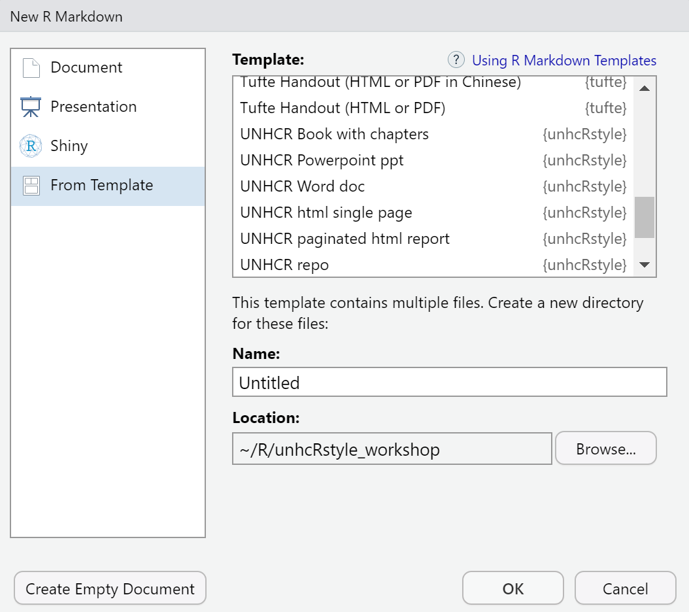

layout: true

<div class="my-footer"><span></span></div> 


```{r setup, include=FALSE}
options(htmltools.dir.version = FALSE)
library(knitr)
knitr::opts_chunk$set(cache = TRUE, 
                      warning = FALSE, 
                      message = FALSE, 
                      dpi = 180,
                      fig.retina = 3,
                      fig.width = 6,
                      fig.asp = 0.618
                      )
#'UNHCR / Americas Bureau /DIMA  <br> <a href="http://github.com/unhcr-americas"><i class="fa fa-github fa-fw"></i>&nbsp; unhcr-americas</a><br> <br><br> See previous Slides available at <https://unhcr-americas.github.io/reproducibility> <br>'

```


---
class: inverse, left, middle

# A Vision for Data Analysis

<span style='font-size:50px; color:grey15;'>"_Multi-functional teams, with strengthened data literacy, regularly conduct meaningful and documented joint data interpretation sessions to define their strategic directions based on statistical evidences_"</span>


???
Slides made with Xaringan - - https://arm.rbind.io/slides/xaringan.html
https://slides.earo.me/rladiesakl20/#1
https://xaringantutorial.netlify.app

---

# A Theory of Change for Data analysis

<span style='font-size:30px;'>Proper use of data for advocacy & programmatic decision making </span>

 <span style='font-size:40px;'>&#8618;</span> Corporate __Standards__ exist to define how to encode & process household surveys dataset

 <span style='font-size:40px;'>&#8618;</span> Field data experts are trained based on precise recipes and predefined tools at each step of the __data life cycle__


 <span style='font-size:40px;'>&#8618;</span> Data are presented, discussed and linked to expert knowledge during data __interpretation__ sessions with a multi-functional team


 <span style='font-size:40px;'>&#8618;</span> All potential valid interpretations, including diverging views, are systematically __recorded__

 <span style='font-size:40px;'>&#8618;</span>  __Persuasive__ "Data Stories“ and Policy papers are generated

---

class: left, middle

# Learning objectives

### 1. How to build charts quickly?

### 2. How to calculate impact indicators from survey data? 

### 3. How to answer Key Research Questions? Describe...

_Explore, Explain to be presented in next webinar!_


???
Depending on the pace of the group, if we do not finish today we will org anise a second session 

---

# Webinar rules

<i class="fa fa-spinner fa-spin fa-fw fa-2x"></i> Leverage this opportunity and make this session __lively__ - there's no stupid questions!

<i class="fa fa-check-square fa-fw fa-2x"></i> Use the __chat__ to send your questions - we are two facilitators and one is focused on replying all questions directly in the chat while the session is on-going

<i class="fa fa-cog fa-fw fa-2x"></i> All practical exercises are designed to get you __testing the commands__:

> Start Rstudio if you have already it installed  or Login now to[cloud-based version of RStudio](https://login.rstudio.cloud/register?redirect=https%3A%2F%2Fclient.login.rstudio.cloud%2Foauth%2Flogin%3Fshow_auth%3D0%26show_login%3D0) for this session  
    
> Paste the command from the chat to your online Rstudio session and check what is happening
    
> In case it is not working as expected, share screenshot or error messages from the console in the chat


---

# Click-based Workflow...


.pull-left[

Associate data  with other tables with **ACCESS** 

...then explore through graphs with **EXCEL**  

...then mapping with **ArcGIS** 

]

.pull-right[

..then write up narratives in **WORD**  

... and design a full document with **INDESIGN** 

... or create an infographic with **ILLUSTRATOR** 
]


???
and eventually some VBA macros 

---

## ... coming up with challenges! 

As a coauthor/reader/peer reviewer, one would like to see the whole **research process** (_how we arrived to that conclusion_), rather than cooked manuscript with inserted tables/figures.


.pull-left[

What analysis is **behind the figure**? Did it accounts for [..._new last minute question_...] in the analysis? 
 
What **dataset** (_final vs preliminary version_) was used ? Were **outliers** identified? How did you **weight** your sample?

Oops, there is an error in the data. Can we **repeat the analysis**? And update quickly the figures, graphs and tables in the report and the presentation! 
]

.pull-right[
> This consumes time and open space for errors...


]


???

When managing numerous analysis with data that may change and in a collaborative mode, this workflow is **not** the most effective. 

 *  Data are manipulated through "point-and-click" user interfaces that are not __captured__!
 *  Data are moving from a software to another (Excel, GIS, Word...) using different __formats__! 
 *  All results (figures, tables) are **manually** copied/pasted to the final publishing system...
 
---


# Science is '_show me_' - not '_trust me_'!

### Reproducible Research Manisfesto; aka the _"Ten Commandments"_ 

.pull-left[

For every result, **keep track** of how it was produced

**Avoid manual data manipulation** steps

**Archive** the exact versions of all external programs used

**Version control** all custom scripts

**Record all intermediate results**, when possible in standardized formats
]

.pull-right[

For analyses that include randomness, **note underlying random seeds**

Always **store raw data** behind plots

Generate hierarchical analysis output, allowing layers of increasing detail to be inspected

Connect **textual statements** to underlying results

Provide **public access** to scripts, runs, and results
]

---

## Enable a fully auditable workflow

As soon as all steps (i.e. **DATA + TIDYING + MODELING + VISUALS + NARRATIVE**) are done through **series of written commands recorded in scripts**:

 - when spotting error in the data, or using different dataset, one just need to adjust in the script and report will update automatically;
 
 - Data manipulation becomes be *de facto* fully documented (no more manual changes in Excel);

 - Analysis is self-explanatory and ready for any kind of collaborative review;

 - Customization are facilitated and allow to deliver  final product  with a professional branding and styling.
 

 
> Analysis becomes streamlined and [reproducible](https://unhcr-americas.github.io/reproducibility)! 

> A "collaboration mode" is enabled from the begining of the process! 

> As your analysis can be reviewed, you become "covered"... 

???
 instead of **hundreds of mouse clicks**
See also http://muschellij2.github.io/summerR_2015/modules/module12.html
---

### Key Concept 1: From "click" to "script"

Using the right combination of packages, you can integrate all necessary data analysis steps into **scripts**:

.pull-left[

Data management (import, clean, recode, merge, reshape)

Data analysis (test, regression, multivariate analysis, etc...)
 
Data visualization (plot, map, graph...)

Writing up results (report and presentation generation)

]

.pull-right[


]


 

---


### Key Concept 2: Everything is an object & Anything can be packaged....


.left-column[


]

.right-column[


`Vectors` are a core single data structure, created with `c()`. 

`Data.frame` where each column is a vector, but adjacent vectors can hold different things

`Matrix` just like a data frame except it's all numeric

`List` are made of any dimension, mix and match

`Factors` are a special class that R uses for categorical variables, which also allows for value labeling and ordering.

`Functions` are object designed to transform one object in a new one

`Charts` are objects  designed to generate an image

`Models` are objects recording computation based on specific data 

]


???
Elements in a vector must be of the same type.
Reference link on [Manipulating data](http://www.cookbook-r.com/Manipulating_data/)


---


### Key Concept 3: Search, Test, Try...

.pull-left[


]

.pull-right[

Get a Certification on R language recognized by UNHCR on [learn.unhcr.org](https://unhcr.csod.com/ui/lms-learner-playlist/PlaylistDetails?playlistId=e90e2279-e3a4-4ef2-8b74-757f91d224b2) and play with [Rstudio Primers](https://rstudio.cloud/learn/primers)

Search and ask in [Stackoverflow](https://stackoverflow.com/questions/tagged/r)

Go through [Cheat-sheets](https://rstudio.cloud/learn/cheat-sheets)

Consult Key Manuals, maybe starting with [R for Data Science](https://r4ds.had.co.nz/)

Browse chart library on [`UnhcrDataPackage`]() 

Follow blogs like general [Rbloggers](https://www.r-bloggers.com/), [Tidyverse blog](https://www.tidyverse.org/blog/) or more specific [HumanitaRian-useR-group](https://humanitarian-user-group.github.io/) as well some twitter accounts.

Join forum like [Inter-Agency R skype group](https://join.skype.com/qYBKC5q3wKp4) or Internal UNHCR Ms Discussion group (ask to join!).

]

---


# Learning stages...

.pull-left[


]

.pull-right[

 __Step 1.__ Develop an understanding of what data science is and what programming and math concepts are needed for it
 
 __Step 2.__ Break data science challenges into small steps - Acquire basic command syntax through very practical and focused project
 
 __Step 3.__ Develop Reproducible Analysis Workflow - Understand the relevance, inputs, constraints, and limitations of the various techniques
 
 __Step 4.__ Optimize your problem solving approaches in elegant ways - Build packages

]

???
https://towardsdatascience.com/the-stages-of-learning-data-science-3cc8be181f54 

See Video - https://www.youtube.com/watch?v=hpMc6TgT34I 

---
# Analytics Models / Algorithms


---
class: center, middle, inverse

# Practical Use Case 1 - Charting

### *My boss needs a slide with the main origin of Asylum Seekers and Refugees from Americas in this country... in 5 minutes....* <i class="fa fa-exclamation-circle fa-fw fa-2x"></i> 


---

## How to get to this chart in a couple of lines?

```{r echo=FALSE, out.width = "80%"}
# Tidyverse
#if (!require("tidyverse")) install.packages("tidyverse", dependencies = TRUE)
library(tidyverse)

# UnhcRverse  
#install.packages("remotes", dependencies = TRUE)
#if (!require("unhcrdatapackage")) remotes::install_github('unhcr/unhcrdatapackage')
library(unhcrdatapackage)

#if (!require("unhcRstyle")) remotes::install_github('unhcr-web/unhcRstyle')
library(unhcRstyle)
 
 
## Loading data
Origin <- dplyr::left_join( x= unhcrdatapackage::end_year_population_totals_long, 
                            y= unhcrdatapackage::reference, 
                            by = c("CountryAsylumCode" = "iso_3"))  %>%
  filter(CountryAsylumName  == "Panama" & 
           UNHCRBureau == "Americas" &
           Year == max(unhcrdatapackage::end_year_population_totals_long$Year) &
           Population.type  %in%c("REF", "ASY", "VDA" )) %>%   
  mutate(CountryOriginName = str_replace(CountryOriginName, " \\(Bolivarian Republic of\\)", ""),
         CountryOriginName = str_replace(CountryOriginName, "Iran \\(Islamic Republic of\\)", "Iran"),
         CountryOriginName = str_replace(CountryOriginName, "United Kingdom of Great Britain and Northern Ireland", "UK")) %>% 
  group_by( CountryOriginName) %>%
  summarise(DisplacedAcrossBorders = sum(Value) )  %>%
  mutate( DisplacedAcrossBordersRound =  ifelse(DisplacedAcrossBorders > 1000, 
                                                paste(scales::label_number_si(accuracy = 0.1)(DisplacedAcrossBorders)),
                                                as.character(DisplacedAcrossBorders) ) ) %>%
  arrange(desc(DisplacedAcrossBorders)) %>%
  head(10)

#Make plot
ggplot(Origin, aes(x = reorder(CountryOriginName, DisplacedAcrossBorders), ## Reordering country by Value
                   y = DisplacedAcrossBorders)) +
  
  # here we configure that it will be bar chart    
  geom_bar(stat = "identity", 
           position = "identity", 
           fill = "#0072bc") + 
  
  ## Format axis number
  scale_y_continuous( label = scales::label_number_si()) + 
  
  ## Position label differently in the bar in white - outside bar in black
  geom_label( data = subset(Origin, DisplacedAcrossBorders < max(DisplacedAcrossBorders) / 1.5),
              aes(x = reorder(CountryOriginName, DisplacedAcrossBorders), 
                  y = DisplacedAcrossBorders,
                  label= DisplacedAcrossBordersRound),
              hjust = -0.1 ,
              vjust = 0.5, 
              colour = "black", 
              fill = NA, 
              label.size = NA, 
              family = "Lato", 
              size = 4   ) +  
  
  geom_label( data = subset(Origin, DisplacedAcrossBorders >= max(DisplacedAcrossBorders) / 1.5),
              aes(x = reorder(CountryOriginName, DisplacedAcrossBorders), 
                  y = DisplacedAcrossBorders,
                  label= DisplacedAcrossBordersRound),
              hjust = 1.1 ,
              vjust = 0.5, 
              colour = "white", 
              fill = NA, 
              label.size = NA, 
              family = "Lato", 
              size = 4   ) +   
  # Add `coord_flip()` to make your vertical bars horizontal:
  coord_flip() + 
  ## and the chart labels
  labs(title = paste0("What are the main Origin of Forced Displacement across Borders?" ),
       subtitle = paste0("Top 10 Origin from Americas - Data as of ",max(unhcrdatapackage::end_year_population_totals_long$Year), "  in Panama" ), 
       x = " ",
       y = "# of Forcibly displaced people",
       caption = "Data: UNHCR Refugee Population Statistics Database.\n Forced Displacement includes Refugees, Asylym Seekers and Venezuelan Displaced Abroad Population Group.") +
  scale_y_continuous( label = scales::label_number_si()) + ## Format axis number
  geom_hline(yintercept = 0, size = 1.1, colour = "#333333") +
  unhcRstyle::unhcr_theme(base_size = 8)  + ## Insert UNHCR Style
  theme(panel.grid.major.x = element_line(color = "#cbcbcb"), 
        panel.grid.major.y = element_blank()) ### changing grid line that should appear
```

???
https://r4ds.had.co.nz/graphics-for-communication.html#figure-sizing 

---

### Install required packages

Got to your [locally installed Rstudio](https://www.rstudio.com/products/rstudio/download/#download) or [sign-up for a free Rstudio Cloud account](https://login.rstudio.cloud/register?redirect=https%3A%2F%2Fclient.login.rstudio.cloud%2Foauth%2Flogin%3Fshow_auth%3D0%26show_login%3D0)

.pull-left[

First create a new project within R studio and then make sure we have the [tidyverse](https://www.tidyverse.org/packages/) plus additional UNHCR packages

```{r, comment='#', evaluate = FALSE} 
# Tidyverse
if (!require("tidyverse")) install.packages("tidyverse", dependencies = TRUE)
if (!require("here")) install.packages("here")

# UnhcRverse  
if (!require("unhcrdatapackage")) remotes::install_github('unhcr/unhcrdatapackage')
if (!require("unhcRstyle")) remotes::install_github('unhcr-web/unhcRstyle')


```
]

 
.pull-right[
```{r, echo = FALSE}
library(tidyverse)
```


  


]

???

The tidyverse is an opinionated collection of R packages designed for data science. All packages share an underlying design philosophy, grammar, and data structures.


---

### Get the data

.pull-left[

To get the data, multiple approaches are possible. 

Go to [UNHCR dataset page on HDX](https://data.humdata.org/dataset/unhcr-population-data-for-world) to download the dataset: `end_year_population_totals_residing_world.csv` and save it locally within your project in a folder name `data-raw`

```{r, comment='#'}
popdata <- read.csv(here::here("data-raw", "end_year_population_totals_residing_world.csv"))
```

or __save time__ and use directly the unhcrdatapackage that includes a reshaped `long` version of the data

```{r, comment='#'}
popdata <- unhcrdatapackage::end_year_population_totals_long

## check the name of the variable
#names(popdata)

## Check the top 5 lines for select variables
# head(popdata %>% select(Year, CountryOriginCode,CountryAsylumCode,Population.type, Value),5) 

```
]


--

.pull-right[
```{r, echo=FALSE}
names(popdata)
library(tidyverse)
knitr::kable(head(popdata %>% select(Year,CountryAsylumCode,Population.type, Value),5), format = 'html')
```
]

---

### Reshape the data  - 1 - Merge with reference

.pull-left[
```{r, comment='#'}
# first merge it with the reference table to get the bureau filter 
#names(unhcrdatapackage::reference)
Origin <- dplyr::left_join(  #<<
  x= unhcrdatapackage::end_year_population_totals_long, 
  y= unhcrdatapackage::reference, 
  by = c("CountryAsylumCode" = "iso_3"))   


# head(names(unhcrdatapackage::reference), 9)
#knitr::kable(head(unhcrdatapackage::reference %>% select(UNHCRBureau,iso_3, ctryname )%>% filter(UNHCRBureau== "Americas" ),   5), format = 'html')
```
]

--

.pull-right[
```{r, echo=FALSE}
head(names(unhcrdatapackage::reference), 9)
knitr::kable(head(unhcrdatapackage::reference %>% select(UNHCRBureau,iso_3, ctryname )%>% filter(UNHCRBureau== "Americas" ),   5), format = 'html')
```
]

---

### Reshape the data - 2 - Filter

.pull-left[
```{r, comment='#'}
Origin <- Origin %>%
  filter( #<<
    CountryAsylumName  == "Panama" & 
    UNHCRBureau == "Americas" &
    Year == max(unhcrdatapackage::end_year_population_totals_long$Year) &
    Population.type  %in%c("REF", "ASY", "VDA" ))

```
]

--

.pull-right[
```{r, echo=FALSE} 
#knitr::kable(head(Origin), format = 'html')
DT::datatable(Origin,
  fillContainer = FALSE, options = list(pageLength = 4))
```
]


---

### Reshape the data - 3 - Shorten country name

.pull-left[
```{r, comment='#'}
Origin <- Origin %>%  
  mutate( #<<
    CountryOriginName = str_replace(CountryOriginName, " \\(Bolivarian Republic of\\)", "")) 

```
]

--

.pull-right[
```{r, echo=FALSE}
knitr::kable(head(Origin), format = 'html')

#DT::datatable(head(Origin, 10),
#  fillContainer = FALSE, options = list(pageLength = 4))
```
]

---


### Reshape the data - 4 - Aggregate by Country of Origin

.pull-left[
```{r, comment='#'}
Origin <- Origin %>%  
  group_by( CountryOriginName) %>% #<<
  summarise(DisplacedAcrossBorders = sum(Value) )  #<<

# DT::datatable(Origin,
#    fillContainer = FALSE, options = list(pageLength = 4))

```
]

--

.pull-right[
```{r, echo=FALSE}
#knitr::kable(head(Origin), format = 'html')

DT::datatable(Origin,
  fillContainer = FALSE, options = list(pageLength = 4))

```
]

---


### Reshape the data - 5 - Create data labels

.pull-left[
```{r, comment='#'}
Origin <- Origin %>%  
  mutate( DisplacedAcrossBordersRound =  ifelse(DisplacedAcrossBorders > 1000, 
                                                paste(scales::label_number_si(accuracy = 0.1)(DisplacedAcrossBorders)),
                                                as.character(DisplacedAcrossBorders) ) ) 

```
]

--

.pull-right[
```{r, echo=FALSE}
knitr::kable(head(Origin), format = 'html')
```
]

---


### Reshape the data - 6 - Select top 10 countries

.pull-left[
```{r, comment='#'}
Origin <- Origin %>%  
  arrange(desc(DisplacedAcrossBorders)) %>%
  head(10)

```
]

--

.pull-right[
```{r, echo=FALSE}
knitr::kable(head(Origin), format = 'html')
```
]

---

### Build the chart - 1 - Initial bar plot

.pull-left[

```{r, eval=FALSE, comment='#'}
plot <- ggplot(Origin, aes(x = reorder(CountryOriginName, DisplacedAcrossBorders), ## Reordering country by Value
                   y = DisplacedAcrossBorders)) +
  
  # here we configure that it will be bar chart    
  geom_bar(stat = "identity", 
           position = "identity", 
           fill = "#0072bc")  
plot
```

]

--

.pull-right[

```{r, echo=FALSE, dev='ragg_png', dpi=300}
plot <- ggplot(Origin, aes(x = reorder(CountryOriginName, DisplacedAcrossBorders), ## Reordering country by Value
                   y = DisplacedAcrossBorders)) +
  
  # here we configure that it will be bar chart    
  geom_bar(stat = "identity", 
           position = "identity", 
           fill = "#0072bc")  
plot
```

]

---

### Build the chart - 2 - Format axis number


.pull-left[

```{r, eval=FALSE, comment='#'}
plot <- plot + 
  scale_y_continuous( label = scales::label_number_si())
plot
```

]

--

.pull-right[

```{r, echo=FALSE, dev='ragg_png', dpi=300}
plot <- plot + 
  scale_y_continuous( label = scales::label_number_si())
plot
```

]

---

### Build the chart - 3 - Flip the chart

.pull-left[

```{r, eval=FALSE, comment='#'}
plot <- plot + 
  coord_flip()

plot

```

]

--

.pull-right[

```{r, echo=FALSE, dev='ragg_png', dpi=300}
plot <- plot + 
  coord_flip()

plot
```

]


---

### Build the chart - 4 - Add and position data label


.pull-left[

```{r, eval=FALSE, comment='#'}
plot <- plot + 
  ## Add label inside the bar in white - outside bar in black
  geom_label( data = subset(Origin, DisplacedAcrossBorders < max(DisplacedAcrossBorders) / 1.5),
              aes(x = reorder(CountryOriginName, DisplacedAcrossBorders), 
                  y = DisplacedAcrossBorders,
                  label= DisplacedAcrossBordersRound),
              hjust = -0.1 ,
              vjust = 0.5, 
              colour = "black", 
              fill = NA,  label.size = NA, 
              family = "Lato", size = 4   ) +  
    ## Add label outside bar in black 
  geom_label( data = subset(Origin, DisplacedAcrossBorders >= max(DisplacedAcrossBorders) / 1.5),
              aes(x = reorder(CountryOriginName, DisplacedAcrossBorders), 
                  y = DisplacedAcrossBorders,
                  label= DisplacedAcrossBordersRound),
              hjust = 1.1 ,
              vjust = 0.5, 
              colour = "white", 
              fill = NA,  label.size = NA, 
              family = "Lato", size = 4   ) 
plot
```

]

--

.pull-right[

```{r, echo=FALSE, dev='ragg_png', dpi=300}
plot <- plot + 
  ## Add label inside the bar in white - outside bar in black
  geom_label( data = subset(Origin, DisplacedAcrossBorders < max(DisplacedAcrossBorders) / 1.5),
              aes(x = reorder(CountryOriginName, DisplacedAcrossBorders), 
                  y = DisplacedAcrossBorders,
                  label= DisplacedAcrossBordersRound),
              hjust = -0.1 ,
              vjust = 0.5, 
              colour = "black", 
              fill = NA, 
              label.size = NA, 
              family = "Lato", 
              size = 4   ) +  
    ## Add label outside bar in black 
  geom_label( data = subset(Origin, DisplacedAcrossBorders >= max(DisplacedAcrossBorders) / 1.5),
              aes(x = reorder(CountryOriginName, DisplacedAcrossBorders), 
                  y = DisplacedAcrossBorders,
                  label= DisplacedAcrossBordersRound),
              hjust = 1.1 ,
              vjust = 0.5, 
              colour = "white", 
              fill = NA, 
              label.size = NA, 
              family = "Lato", 
              size = 4   ) 
plot
```

]

---

### Build the chart - 5 - Add chart labels

.pull-left[

```{r, eval=FALSE, comment='#'}
plot <- plot +  
  ## and the chart labels
  labs(title = "What are the main Origin of Forced Displacement across Borders?",
       subtitle = paste0("Top 10 Origin from Americas - Data as of ",max(unhcrdatapackage::end_year_population_totals_long$Year), "  in Panama" ), 
       x = " ",
       y = "# of Forcibly displaced people",
       caption = "Data: UNHCR Refugee Population Statistics Database.\n Forced Displacement includes Refugees, Asylym Seekers and Venezuelan Displaced Abroad Population Group.") 
plot
```

]

--

.pull-right[

```{r, echo=FALSE, dev='ragg_png', dpi=300}
plot <- plot +  
  ## and the chart labels
  labs(title = "What are the main Origin of Forced Displacement across Borders?",
       subtitle = paste0("Top 10 Origin from Americas - Data as of ",max(unhcrdatapackage::end_year_population_totals_long$Year), "  in Panama" ), 
       x = " ",
       y = "# of Forcibly displaced people",
       caption = "Data: UNHCR Refugee Population Statistics Database.\n Forced Displacement includes Refugees, Asylym Seekers and Venezuelan Displaced Abroad Population Group.") 
plot
```

]

---

### Build the chart - 6 - Apply unhcRstyle

.pull-left[

```{r, eval=FALSE, comment='#'}
plot <- plot +  
  unhcRstyle::unhcr_theme(base_size = 8)  
plot
```

]

--

.pull-right[

```{r, echo=FALSE, dev='ragg_png', dpi=300}
plot <- plot +  
  unhcRstyle::unhcr_theme(base_size = 8)  
plot
```

]

---

### Build the chart - 7 - Adjust graphical element

.pull-left[

```{r, eval=FALSE, comment='#'}
plot <- plot +  
  ## Hihlight axis line
  geom_hline(yintercept = 0, size = 1.1, colour = "#333333") +
  theme(
    ### changing grid line that should appear
    panel.grid.major.x = element_line(color = "#cbcbcb"),
    panel.grid.major.y = element_blank()) 
plot
```

]

--

.pull-right[

```{r, echo=FALSE, dev='ragg_png', dpi=300}
plot <- plot +  
  ## Hihlight axis line
  geom_hline(yintercept = 0, size = 1.1, colour = "#333333") +
  theme(
    ### changing grid line that should appear
    panel.grid.major.x = element_line(color = "#cbcbcb"),
    panel.grid.major.y = element_blank()) 
plot
```

]

---

# The Grammar of graphics in 7 key syntax

.img75[]
[@CedSherer](https://twitter.com/CedScherer/status/1229418108122783744?s=20)

???
**Data**
- Data is not just data
- Representation defines what can be done with it
- Grammar requires a tidy format (though it precedes the notion) 

**Aesthetics**
- Allow generic datasets to be understood by the graphic system.
- Link variables in data to graphical properties in the geometry.

**Layers**
1. Geom
    - How to interpret aesthetics as graphical representations
    - Is a progression of positional aesthetics a number of points, a line, a single polygon, or something else entirely?
2. Stats
    - Transform input variables to displayed values
    - Is implicit in many plot-types but can often be done prior to plotting

**Scales**
- A scale translate back and forth between variable ranges and property ranges
    - Categories > Colour
    - Numbers > Position

**Coordinates**
- Defines the physical mapping of the aesthetics to the paper 

**Facets**
- Define the number of panels with equal logic and split data among them…
- Small multiples 

**Themes**
- Theming spans every part of the graphic that is not linked to data

---


.pull-left[

### Insert this in a slide deck -  Report template....

All based on Rmarkdown that allow to create multiple outputs from the same content format.

- Powerpoint with UNHCR style

- Word with UNHCR style

- html/bootstrap -scroll-able report

- html/slide - slide-able report (WIP)

- Paginated report built on the top of pagedown.

- Analysis Repository contribution


]

.pull-right[

Access them **"From Template"** panel when creating a new Rmd document



]


---
class: center, middle, inverse


# Practical Use Case 2 - Building impact indicators from Survey Data

### *The National Household Survey is including Forcibly Displaced People and got published yesterday... We need to report our indicators by tomorrow!  * <i class="fa fa-exclamation-triangle fa-fw fa-2x"></i> 


???


We will use the “Encuesta Nacional de Calidad de Vida ECV 2020” published by the National Office of Colombia (http://microdatos.dane.gov.co/index.php/catalog/718/get_microdata) and explore different type of statistical analysis based on an example of three research questions:


---

## How to get to this chart in a couple of lines?

```{r echo=FALSE, out.width = "80%"}
#Prepare data2
library(tidyverse)
# all the dataset will be stored in a list object
datasets <- fs::dir_ls(here::here("data-raw"), 
                       glob = "*.sav") %>% 
            map(compose(as_factor, haven::read_sav))

# Bind together datasets with the same unit of analysis
persons <- datasets %>% 
           keep(~!all(.$SECUENCIA_P == 1) &
                  !all(.$SECUENCIA_ENCUESTA == 1)) %>% 
           reduce(full_join)

households <- datasets %>% 
              keep(~all(.$SECUENCIA_P == 1) & 
                     !all(.$SECUENCIA_ENCUESTA == 1)) %>% 
              reduce(full_join)


# harmonize key variables - 
# notice how SECUENCIA_ENCUESTA changes meaning between datasets
persons <- persons %>% 
           rename(dwelling = DIRECTORIO, 
                  household = SECUENCIA_P, 
                  person = SECUENCIA_ENCUESTA)

households <- households %>% 
              rename(dwelling = DIRECTORIO, 
                     household = SECUENCIA_ENCUESTA) %>% 
              select(-ORDEN)

data <-  
  left_join(persons, households) %>% 
  transmute(pop = case_when(is.na(P756S3) ~ "Colombians",
                            P756S3 == "Venezuela" ~ "Venezuelans",
                            TRUE ~ "Others"))

indicators <-  
  left_join(persons, households) %>% 
  transmute(pop = case_when(is.na(P756S3) ~ "Colombians",
                            P756S3 == "Venezuela" ~ "Venezuelans",
                            TRUE ~ "Others"),
            
            # 2.1 Proportion of PoC living below the national poverty line
            rbm2.1 = PERCAPITA < 327674, 
            
            water = P792 != "No tienen el servicio",
            sanitation = P5032 != "No tienen el servicio",
            overcrowding = CANT_PERSONAS_HOGAR/P5000 > 3,
            secure_tenure = 
              P5095 == "Propia, totalmente pagada" |
              P5095 == "Propia, lo están pagando" |
              (P5095 == "En arriendo o subarriendo" & P3006 == "Escrito"),
            housing_durability = TRUE, # FIXME: correct when we get the missing data file
       
            # 2.2 Proportion of PoCs residing in physically safe and secure settlements 
            # with access to basic facilities
            rbm2.2 = water & sanitation & !overcrowding & housing_durability & secure_tenure,
            
            # 2.3 Proportion of PoC with access to health services
            rbm2.3 = if_else(P5665 == "Sí", is.na(P6153), NA),
            dpto = "dummy", # FIXME: should be dwellings$dpto,
            wt = FEX_C)  %>%
         
         ## Remove the neither colombian nor venezuelan
         filter(pop != "Others") %>% 
         
         ## transform in a srvey weighter dataset
         srvyr::as_survey_design(strata = dpto, 
                          weights = wt) %>% 
         ## Compile indicators by group
         group_by(pop) %>% 
         summarize(across(contains("rbm"), 
                          srvyr::survey_mean, 
                          vartype = "ci", 
                          na.rm = TRUE,
                          .names = "{.col}_est")) %>% 
         pivot_longer(-pop, 
                      names_to = c("ind", ".value"), 
                      names_pattern = "(.+?)_(.+)")

rbm_indicators <- 
  c(rbm2.1 = "2.1 Proportion of PoC living below the national poverty line",
    rbm2.2 = "2.2 Proportion of PoCs residing in physically safe and secure settlements with access to basic facilities.",
    rbm2.3 = "2.3 Proportion of PoC with access to health services")


ggplot( data = indicators,
  aes(est, fct_rev(ind))) +
  geom_pointrange(aes(xmin = est_low, 
                      xmax = est_upp, 
                      color = pop), 
                  size = .75) +
  geom_text(aes(label = scales::label_percent(.1)(est)), 
                 vjust = -1.25) +
  scale_x_continuous(labels = scales::label_percent(), 
                     limits = c(0, 1), 
                     breaks = c(0, .5, 1)) +
  scale_y_discrete(labels = str_wrap(rev(rbm_indicators), 40)) +
  scale_color_manual(values = c(Colombians = "black", Venezuelans = "#0072BC")) +
  labs(x = "Estimate", 
       y = " ",
       title = "Impact Area 2: Realizing Rights in Safe Environments",
       caption = glue::glue("Encuesta Nacional de Calidad de Vida (ECV) 2020\n",
                            "# of Venezuelans = {scales::label_comma()(sum(data$pop=='Venezuelans'))} obs. ",
                            "({scales::label_number_si(.1)(sum((data$pop=='Venezuelans')*data$wt))} weighted)")) +
  unhcRstyle::unhcr_theme(base_size = 8) +
  theme(panel.grid.minor.x = element_blank())

```


---


### Install packages

The particularity of HH survey dataset, when stored in SPSS (`.sav`), SAS (`.sas7bdat`), or Stata (`.dta`) format is that they usually contains both values and __associated labels__ (we call them `labelled data`).

.pull-left[

```{r , eval=FALSE, comment='#'}


if (!require("haven")) install.packages("haven", dependencies = TRUE) 
if (!require("labelled")) install.packages("labelled", dependencies = TRUE)
if (!require("sjPlot")) install.packages("sjPlot", dependencies = TRUE)
if (!require("DT")) install.packages("DT", dependencies = TRUE)
 
```
]

--

.pull-right[
  

]

???
https://www.pipinghotdata.com/posts/2020-12-23-leveraging-labelled-data-in-r/ 

---


### Get the data


The dataset,  [Encuesta Nacional de Calidad de Vida ECV 2020, Colombia, DANE](http://microdatos.dane.gov.co/index.php/catalog/718/get_microdata) is available through a micro data library.  

.left-column[
```{r , eval=FALSE, comment='#'}
##  Household composition where disaggregation variables are
data0 <- haven::read_sav(here::here("data-raw", "Características y composición del hogar.sav"))

## Display frame content
# data0 %>% 
#        sjPlot::view_df()

# view_df() offers many options, e.g. to add the frequencies of values, 
# the amount of missing values per variable, 
#or even weighted frequencies.
  # show.na = TRUE, 
  # show.type = TRUE, 
  # show.frq = TRUE, 
  # show.prc = TRUE, 
  # show.string.values = TRUE, 
  # show.id = TRUE 
```
]

--

.right-column[
```{r , echo=FALSE}
data0 <- haven::read_sav(here::here("data-raw", "Características y composición del hogar.sav"))

## Display frame content
data0 %>%
       sjPlot::view_df()
```
]

???
https://www.pipinghotdata.com/posts/2020-12-23-leveraging-labelled-data-in-r/ 

Here are operations I commonly perform on labelled data:

    Evaluate if variable is of class haven_labelled.

        Why? Troubleshooting, exploring, mutating.

        Function(s): haven::is.labelled()

    Convert haven_labelled variable to numeric value codes.

        Why? To treat the variable as continuous for analysis. For example, if a 1-7 rating scale imports as labelled and you want to compute a mean.

        Function(s): base::as.numeric() (strips variable of all metadata), haven::zap_labels() and labelled::remove_val_labels (removes value labels, retains other metadata)

    Convert haven_labelled() variable to factor with value labels.

        Why? To treat the variable as categorical for analysis.

        Function(s): haven::as_factor(), labelled::to_factor(), sjlabelled::as_label(). As far as I can tell, these three functions have the same result. By default, the factor levels are ordered by value codes.

    Convert variable label to variable name.

        Why? For more informative or readable variable names.

        Function(s): sjlabelled::label_to_colnames()


---

### Search in generated data dictionnary


.left-column[

```{r , eval=FALSE, comment='#'}
# create data dictionary  
dictionary <- labelled::generate_dictionary(data0)
View(dictionary)

# library(DT)
# dictionary %>% 
#   DT::datatable()
```
]

--

.right-column[

```{r , echo=FALSE}
dictionary <- labelled::generate_dictionary(data0)
dictionary %>% 
   DT::datatable()
```

]

???

---

### Simple plot with labelled data

.pull-left[

```{r , eval=FALSE, comment='#'}
plot <- sjPlot::plot_frq(
                 data = data0$P756S3, 
                 type = "bar",
                 sort.frq =  "asc",
                 coord.flip = TRUE,
                 weight.by = as.vector(data0$FEX_C),
                 show.ci = TRUE) 
plot

```
]

--


.pull-right[

```{r , echo=FALSE, dev='ragg_png', dpi=300}
plot <- sjPlot::plot_frq(
                 data = data0$P756S3, 
                 type = "bar",
                 sort.frq =  "asc",
                 coord.flip = TRUE,
                 weight.by = as.vector(data0$FEX_C),
                 show.ci = TRUE) 
plot
```
]

---

### Style the plot
.pull-left[

```{r , eval=FALSE, comment='#'}
plot <- plot + 
      scale_y_continuous(labels = scales::label_number_si()) + 
      labs(title = paste0(sjlabelled::get_label(data0$P756S3)),
           x = "", y = "",
           caption = "Source: Encusta Nacional de Calidad de Vida ECV 2020, Colombia, DANE")+
      unhcRstyle::unhcr_theme(base_size = 8)  + 
      theme(legend.position = "none",
            panel.grid.major.x  = element_line(color = "#cbcbcb"), 
            panel.grid.major.y  = element_blank(), 
            panel.grid.minor = element_blank()) 
plot

```
]

--


.pull-right[

```{r , echo=FALSE, dev='ragg_png', dpi=300}
plot <- plot +
  
  
      scale_y_continuous(labels = scales::label_number_si()) + 
      labs(title = paste0(sjlabelled::get_label(data0$P756S3)),
           x = "", y = "",
           caption = "Source: Encusta Nacional de Calidad de Vida ECV 2020, Colombia, DANE")+
      unhcRstyle::unhcr_theme(base_size = 8)  + 
      theme(legend.position = "none",
            panel.grid.major.x  = element_line(color = "#cbcbcb"), 
            panel.grid.major.y  = element_blank(), 
            panel.grid.minor = element_blank()) 
plot
```
]

---

### Get all data files together

.pull-left[
```{r , eval=FALSE, comment='#'}
# get a list of files in a folder with specific sav extension in the data-raw folder

datasetlist <- fs::dir_ls(here::here("data-raw"), 
                       glob = "*.sav")  
# head(datasetlist, 2)

# read all the files 
# all the dataset will be stored in a list object
datasets <- datasetlist %>% 
            map(compose(as_factor, haven::read_sav))
# class(datasets)
 
```
]

--

.pull-right[
```{r , echo=FALSE}

# get a list of files in a folder with specific sav extension in the data-raw folder

datasetlist <- fs::dir_ls(here::here("data-raw"), 
                       glob = "*.sav")  

cat(" Print datasetlist first 2 lines")
head(datasetlist, 2)
# read all the files 
# all the dataset will be stored in a list object
datasets <- datasetlist %>% 
            map(compose(as_factor, haven::read_sav))

cat(" Print dataset class")
class(datasets)
 
```
]

???
 

---

### Join data frame for Individuals

.pull-left[
```{r , eval=FALSE, comment='#'}
# Bind together datasets with the same unit of analysis
persons <- datasets %>% 
           keep(~!all(.$SECUENCIA_P == 1) &
                  !all(.$SECUENCIA_ENCUESTA == 1)) %>% 
           reduce(full_join)

# harmonize key variables - 
# notice how SECUENCIA_ENCUESTA changes meaning between datasets
persons <- persons %>% 
           rename(dwelling = DIRECTORIO, 
                  household = SECUENCIA_P, 
                  person = SECUENCIA_ENCUESTA)
# nrow(persons)
# ncol(persons)
```
]

--

.pull-right[
```{r , echo=FALSE}
# read data based on a list of files in a folder with a specific extension (i.e. sav)
# all the dataset will be stored in a list object
datasets <- fs::dir_ls(here::here("data-raw"), 
                       glob = "*.sav") %>% 
            map(compose(as_factor, haven::read_sav))

# Bind together datasets with the same unit of analysis
persons <- datasets %>% 
           keep(~!all(.$SECUENCIA_P == 1) &
                  !all(.$SECUENCIA_ENCUESTA == 1)) %>% 
           reduce(full_join)
# Harmonize Key Variables 
# notice how SECUENCIA_ENCUESTA changes meaning between datasets
persons <- persons %>% 
           rename(dwelling = DIRECTORIO, 
                  household = SECUENCIA_P, 
                  person = SECUENCIA_ENCUESTA)

nrow(persons)
ncol(persons)
```
]

???
 

---

### Join data frame for Household

.pull-left[
```{r , eval=FALSE, comment='#'}

households <- datasets %>% 
              keep(~all(.$SECUENCIA_P == 1) & 
                     !all(.$SECUENCIA_ENCUESTA == 1)) %>% 
              reduce(full_join)


# harmonize key variables - 
# notice how SECUENCIA_ENCUESTA changes meaning between datasets

households <- households %>% 
              rename(dwelling = DIRECTORIO, 
                     household = SECUENCIA_ENCUESTA) %>% 
              select(-ORDEN)
# nrow(households)
#ncol(households)
```
]

--

.pull-right[
```{r , echo=FALSE}
households <- datasets %>% 
              keep(~all(.$SECUENCIA_P == 1) & 
                     !all(.$SECUENCIA_ENCUESTA == 1)) %>% 
              reduce(full_join)


# Harmonize Key Variables 
# notice how SECUENCIA_ENCUESTA changes meaning between datasets
households <- households %>% 
              rename(dwelling = DIRECTORIO, 
                     household = SECUENCIA_ENCUESTA) %>% 
              select(-ORDEN)
nrow(households)
ncol(households)
```
]

---

### Identify Venezuelan

.pull-left[

```{r , eval=FALSE, comment='#'}
library(tidyverse)
data <-  
  left_join(persons, households) %>% 
  transmute(pop = case_when(is.na(P756S3) ~ "Colombians",
                            P756S3 == "Venezuela" ~ "Venezuelans",
                            TRUE ~ "Others")) 

# table(data$pop, useNA = "ifany")
```
]

--

.pull-right[
```{r , echo=FALSE}

library(tidyverse)
data <-  
  left_join(persons, households) %>% 
  transmute(pop = case_when(is.na(P756S3) ~ "Colombians",
                            P756S3 == "Venezuela" ~ "Venezuelans",
                            TRUE ~ "Others"))

table(data$pop, useNA = "ifany")
```
]

???
 
---

### Create Indicators

.pull-left[

```{r , eval=FALSE, comment='#'}
indicators <-   left_join(persons, households) %>% 
  transmute(pop = case_when(is.na(P756S3) ~ "Colombians",
                            P756S3 == "Venezuela" ~ "Venezuelans",
                            TRUE ~ "Others"),
            
            # 2.1 Proportion of PoC living below the national poverty line
            rbm2.1 = PERCAPITA < 327674, 
            
            water = P792 != "No tienen el servicio",
            sanitation = P5032 != "No tienen el servicio",
            overcrowding = CANT_PERSONAS_HOGAR/P5000 > 3,
            secure_tenure = 
              P5095 == "Propia, totalmente pagada" |
              P5095 == "Propia, lo están pagando" |
              (P5095 == "En arriendo o subarriendo" & P3006 == "Escrito"),
            housing_durability = TRUE, # FIXME: correct when we get the missing data file
       
            # 2.2 Proportion of PoCs residing in physically safe and secure settlements 
            # with access to basic facilities
            rbm2.2 = water & sanitation & !overcrowding & housing_durability & secure_tenure,
            
            # 2.3 Proportion of PoC with access to health services
            rbm2.3 = if_else(P5665 == "Sí", is.na(P6153), NA),
            dpto = "dummy", # FIXME: should be dwellings$dpto,
            wt = FEX_C)   

#knitr::kable(head(indicators %>%
#                    select(pop, rbm2.1, rbm2.2, rbm2.3 )),
#             format = 'html')
```
]

--

.pull-right[
```{r , echo=FALSE}
indicators <-   left_join(persons, households) %>% 
  transmute(pop = case_when(is.na(P756S3) ~ "Colombians",
                            P756S3 == "Venezuela" ~ "Venezuelans",
                            TRUE ~ "Others"),
            
            # 2.1 Proportion of PoC living below the national poverty line
            rbm2.1 = PERCAPITA < 327674, 
            
            water = P792 != "No tienen el servicio",
            sanitation = P5032 != "No tienen el servicio",
            overcrowding = CANT_PERSONAS_HOGAR/P5000 > 3,
            secure_tenure = 
              P5095 == "Propia, totalmente pagada" |
              P5095 == "Propia, lo están pagando" |
              (P5095 == "En arriendo o subarriendo" & P3006 == "Escrito"),
            housing_durability = TRUE, # FIXME: correct when we get the missing data file
       
            # 2.2 Proportion of PoCs residing in physically safe and secure settlements 
            # with access to basic facilities
            rbm2.2 = water & sanitation & !overcrowding & housing_durability & secure_tenure,
            
            # 2.3 Proportion of PoC with access to health services
            rbm2.3 = if_else(P5665 == "Sí", is.na(P6153), NA),
            dpto = "dummy", # FIXME: should be dwellings$dpto,
            wt = FEX_C)  

knitr::kable(head(indicators %>%
                    select(pop, rbm2.1, rbm2.2, rbm2.3 )),
             format = 'html')

```
]

???
 
---

### Aggregate Value

.pull-left[

```{r , eval=FALSE, comment='#'}
indicators <-  indicators   %>%
        ## Remove the neither colombian nor venezuelan
        filter(pop != "Others") %>% 
         
        ## transform in a srvey weighter dataset
         srvyr::as_survey_design(strata = dpto, 
                          weights = wt) %>% 
         ## Compile indicators by group
         group_by(pop) %>% 
         summarize(across(contains("rbm"), 
                          srvyr::survey_mean, 
                          vartype = "ci", 
                          na.rm = TRUE,
                          .names = "{.col}_est")) %>% 
         pivot_longer(-pop, 
                      names_to = c("ind", ".value"), 
                      names_pattern = "(.+?)_(.+)")

# knitr::kable(head(indicators %>%
#                    select(pop, ind, est )), format = 'html')

```
]

--

.pull-right[
```{r , echo=FALSE}
indicators <-  indicators   %>%
        ## Remove the neither colombian nor venezuelan
        filter(pop != "Others") %>% 
         
        ## transform in a srvey weighter dataset
         srvyr::as_survey_design(strata = dpto, 
                          weights = wt) %>% 
         ## Compile indicators by group
         group_by(pop) %>% 
         summarize(across(contains("rbm"), 
                          srvyr::survey_mean, 
                          vartype = "ci", 
                          na.rm = TRUE,
                          .names = "{.col}_est")) %>% 
         pivot_longer(-pop, 
                      names_to = c("ind", ".value"), 
                      names_pattern = "(.+?)_(.+)")

knitr::kable(head(indicators %>%
                    select(pop, ind, est )), format = 'html')

```
]

???
 

---

### Generate chart

.pull-left[

```{r , eval=FALSE, comment='#'}
## Add labels for each calculated indicators
rbm_indicators <- 
  c(rbm2.1 = "2.1 Proportion of PoC living below the national poverty line",
    rbm2.2 = "2.2 Proportion of PoCs residing in physically safe and secure settlements with access to basic facilities.",
    rbm2.3 = "2.3 Proportion of PoC with access to health services")

ggplot( data = indicators,
  aes(est, fct_rev(ind))) +
  geom_pointrange(aes(xmin = est_low, 
                      xmax = est_upp, 
                      color = pop), 
                  size = .75) +
  geom_text(aes(label = scales::label_percent(.1)(est)), 
                 vjust = -1.25) +
  scale_x_continuous(labels = scales::label_percent(), 
                     limits = c(0, 1), 
                     breaks = c(0, .5, 1)) +
  scale_y_discrete(labels = str_wrap(rev(rbm_indicators), 40)) +
  scale_color_manual(values = c(Colombians = "black", Venezuelans = "#0072BC")) +
  labs(x = "Estimate", y = "",
       title = "Impact Area 2: Realizing Rights in Safe Environments",
       caption = glue::glue("Encuesta Nacional de Calidad de Vida (ECV) 2020\n",
                            "# of Venezuelans = {scales::label_comma()(sum(data$pop=='Venezuelans'))} obs. ",
                            "({scales::label_number_si(.1)(sum((data$pop=='Venezuelans')*data$wt))} weighted)")) +
  unhcRstyle::unhcr_theme(base = 8) +
  theme(panel.grid.minor.x = element_blank())
```
]

--

.pull-right[
```{r , echo=FALSE}
## Add labels for each calculated indicators
rbm_indicaors <- 
  c(rbm2.1 = "2.1 Proportion of PoC living below the national poverty line",
    rbm2.2 = "2.2 Proportion of PoCs residing in physically safe and secure settlements with access to basic facilities.",
    rbm2.3 = "2.3 Proportion of PoC with access to health services")


ggplot( data = indicators,
  aes(est, fct_rev(ind))) +
  geom_pointrange(aes(xmin = est_low, 
                      xmax = est_upp, 
                      color = pop), 
                  size = .75) +
  geom_text(aes(label = scales::label_percent(.1)(est)), 
                 vjust = -1.25) +
  scale_x_continuous(labels = scales::label_percent(), 
                     limits = c(0, 1), 
                     breaks = c(0, .5, 1)) +
  scale_y_discrete(labels = str_wrap(rev(rbm_indicaors), 40)) +
  scale_color_manual(values = c(Colombians = "black", Venezuelans = "#0072BC")) +
  labs(x = "estimate", 
       y = "indicator",
       title = "Impact Area 2: Realizing Rights in Safe Environments",
       caption = glue::glue("Encuesta Nacional de Calidad de Vida (ECV) 2020\n",
                            "# of Venezuelans = {scales::label_comma()(sum(data$pop=='Venezuelans'))} obs. ",
                            "({scales::label_number_si(.1)(sum((data$pop=='Venezuelans')*data$wt))} weighted)")) +
  unhcRstyle::unhcr_theme() +
  theme(panel.grid.minor.x = element_blank())
```
]

???

class: center, middle, inverse


# Practical Use Case 3 - Evidence for key research question

### * What programmatic assumptions do we have evidences for? Describe, Explore, Explain...  *  <i class="fa fa-eye fa-fw fa-2x"></i> 


---

## Statistical association analysis: Crosstabulation & Assocation


> __Question__: How is the perception of current situation compared to that of 5 years ago differs between the "undocumented Venezuelans" and the rest of the population? 
 
See you in the R master webinar in January !


???

---

## Regression analysis between a target variable and multiple predictors
> __Question__: What can explain why some "undocumented Venezuelans" feel worse now than five years ago? 
 
See you in the R master webinar in January !

---

## Clustering analysis to identify a homogeneous group of individuals based on multiple variables

> __Question__: What are the main profiles of "undocumented Venezuelans" who have a worse situation now than 5 years ago? 
  
 
See you in the R master webinar in February !   

---
class: left, top

# Good luck in your R journey!

### Reach out to us for questions, analysis mentoring or code peer review!


.pull-left[

__DIMA Americas__: <br>
Edouard Legoupil, _Snr Statistics & Data Analysis Officer_, <a href="mailto:legoupil@unhcr.org"><i class="fa fa-paper-plane fa-fw"></i>&nbsp; legoupil@unhcr.org</a> | <a href="http://twitter.com/edouard_lgp"><i class="fa fa-twitter fa-fw"></i>&nbsp; @edouard_lgp</a> <br> 
Hisham Galal, _Associate Statistics & Data Analysis Officer_, <a href="mailto:galal@unhcr.org"><i class="fa fa-paper-plane fa-fw"></i>&nbsp; galal@unhcr.org</a>


Check our github @ <a href="http://github.com/unhcr-americas"><i class="fa fa-github fa-fw"></i>&nbsp;unhcr-americas</a>  and learn about __UnhcRverse packages__<br>

Slides created with [**remark.js**](http://remarkjs.com/) and the R package [**xaringan**](https://github.com/yihui/xaringan). Slides notes for this presentation can be displayed by pressing keyboard shortcut `p` - Navigation help with keyboard shortcut `h`


]

.pull-right[


]


???


Last, we hope that this session will motivate you to join the vibrant R users community in UNHCR and soon become an R champion. In order to make the most of the session, we would advise you to install the following open source environment: 

    R - https://cran.r-project.org/bin/windows/base/ 

    Rstudio Free version: https://www.rstudio.com/products/rstudio/download/ 

    Create an account on Github - https://github.com/join?  and install Github desktop https://desktop.github.com/ 

You may also start installing UNHCR Packages – following the instruction in their respective documentation published on Github: 

    Use UNHCR Open data  - https://unhcr.github.io/unhcrdatapackage/docs/  

    API to connect to internal data source - https://unhcr-web.github.io/hcrdata/docs/ 

    Perform High Frequency Check https://unhcr.github.io/HighFrequencyChecks/docs/ 

    Process data crunching for survey dataset - https://unhcr.github.io/koboloadeR/docs/  

    Use UNHCR graphical template- https://unhcr-web.github.io/unhcRstyle/docs/ 

See some practical tutorial on https://humanitarian-user-group.github.io/  

The best way to start and learn is to have a concrete project! If you have one and need mentoring, we can liaise after the session. 

Resources Ggplot:

- [Ggplot main doc](https://ggplot2.tidyverse.org/index.html)
- [The ggplot flipbook](https://evamaerey.github.io/ggplot_flipbook/ggplot_flipbook_xaringan.html#1) by Gina Reynolds
- [A ggplot2 tutorial for beautiful plotting in R](https://www.cedricscherer.com/2019/08/05/a-ggplot2-tutorial-for-beautiful-plotting-in-r/) and [ggplot Wizardry Hands-On](https://z3tt.github.io/OutlierConf2021/) by Cedric Scherer
- Ggplot workshop [Part1](https://www.youtube.com/watch?v=h29g21z0a68)/[Part2](https://www.youtube.com/watch?v=0m4yywqNPVY) by Thomas Lin Pedersen (one of the main maintainer of ggplot)


 
 packages extension for ggplot

- Patchwork to bind multiple plots on one

- Gganimate to create simple animation

- Ggtext and ggrepel to deal with annotation and text style

- Ggforce to group some content visually

- and much more.... just go out there and experiment


